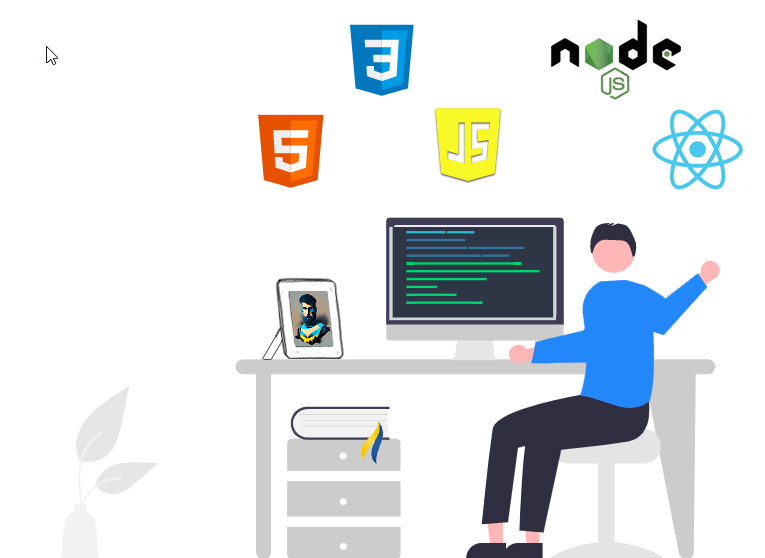

<h1 align="center">Hi 👋, I'm Valeriy Yuriy</h1>
<h3 align="center">✨ An enthusiastic and driven Junior Software Developer, freshly empowered by completing studies at a leading software development school, ready to take on new challenges. 😄</h3>

 
🌟 With a passion for problem-solving, a dedication to continuous learning, and an open mind for new work, 🚀 I'm eager to contribute to innovative projects 🌟 and thrive in the dynamic world of software development. 🔧

---

- 🔭 I’m currently working on **My Portfolio**<!--[My Portfolio](https://www.linkedin.com/in/valeriy-yuriy-051919260/)-->
- 🌱 I’m currently learning **Javascript**
- ⚡ Fun fact: **From fixing mechanical gears to coding bugs, I'm engineering a career shift from nuts and bolts to pixels and code. Preparing to swap my toolkit for a keyboard and embrace a whole new world of software engineering. I'am turning into a "mechano-coder," ready to build digital solutions with a twist!**

---

| 
**Contact me:**

 

 

 
 |  |
| :------------------------------------------------------------------------------------------------------------------------------------------------------------------------------------------------------------------------------------------------------------------------------------------------------------------------------------------------------------------------------------------------------------------------------------------------------------------------------------------------------------------------------------------------: | :-----------------------------: |

 

<h3 align="center">LANGUAGES and TOOLS:</h3>

 
<code></code>
<code></code>
<code></code>

---

<code></code>
<code></code>
<code></code>
<code></code>
<code></code>
<code></code>
<code></code>
<code></code>
<code></code>
<code></code>
<code></code>
<code></code>
<code></code>
<code></code>

 

#

#
